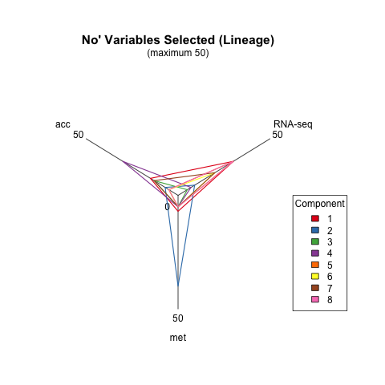

```{r setup, include=FALSE}
knitr::opts_chunk$set(echo = TRUE)
```


# Objective(s)

- Show choice.keepX in diablo in form of a radar plot such as: https://www.r-graph-gallery.com/143-spider-chart-with-saveral-individuals.html


Q: is it better to have the lines as Omics or as comps?

```{r}
# install.packages("fmsb")
library(fmsb)
```

## radarchart

All versions:
```{r}
# Library
library(fmsb)
# Data must be given as the data frame, where the first cases show maximum.
maxmin <- data.frame(
    total=c(5, 1),
    phys=c(15, 3),
    psycho=c(3, 0),
    social=c(5, 1),
    env=c(5, 1))
# data for radarchart function version 1 series, minimum value must be omitted from above.
RNGkind("Mersenne-Twister")
set.seed(123)
dat <- data.frame(
    total=runif(3, 1, 5),
    phys=rnorm(3, 10, 2),
    psycho=c(0.5, NA, 3),
    social=runif(3, 1, 5),
    env=c(5, 2.5, 4))
dat <- rbind(maxmin,dat)
op <- par(mar=c(1, 2, 2, 1),mfrow=c(2, 2))
radarchart(dat, axistype=1, seg=5, plty=1, vlabels=c("Total\nQOL", "Physical\naspects", 
                                                     "Phychological\naspects", "Social\naspects", "Environmental\naspects"), 
           title="(axis=1, 5 segments, with specified vlabels)", vlcex=0.5)
radarchart(dat, axistype=2, pcol=topo.colors(3), plty=1, pdensity=c(5, 10, 30), 
           pangle=c(10, 45, 120), pfcol=topo.colors(3), 
           title="(topo.colors, fill, axis=2)")
radarchart(dat, axistype=3, pty=32, plty=1, axislabcol="grey", na.itp=FALSE,
           title="(no points, axis=3, na.itp=FALSE)")
radarchart(dat, axistype=1, plwd=1:5, pcol=1, centerzero=TRUE, 
           seg=4, caxislabels=c("worst", "", "", "", "best"),
           title="(use lty and lwd but b/w, axis=1,\n centerzero=TRUE, with centerlabels)")
par(op)
```

```{r}
# Library
library(fmsb)
 
# Create data: note in High school for several students
set.seed(99)
data <- as.data.frame(matrix( sample( 0:20 , 15 , replace=F) , ncol=5))
colnames(data) <- c("math" , "english" , "biology" , "music" , "R-coding" )
colnames(data) <- paste0("Omic-", 1:5)
rownames(data) <- paste("mister" , letters[1:3] , sep="-")
 
# To use the fmsb package, I have to add 2 lines to the dataframe: the max and min of each variable to show on the plot!
data <- rbind(rep(20,5) , rep(0,5) , data)
 
# plot with default options:
radarchart(data)
## ---------------------- or
colnames(data) <- paste0("Comp-", 1:5)
# plot with default options:
radarchart(data)
```

## tune.block.splsda

```{r}
RNGversion(.mixo_rng())
set.seed(43)
data("breast.TCGA")
dat = list(mrna = breast.TCGA$data.train$mrna, mirna = breast.TCGA$data.train$mirna,
protein = breast.TCGA$data.train$protein)
design = matrix(1, ncol = length(dat), nrow = length(dat),
dimnames = list(names(dat), names(dat)))
diag(design) =  0
ncomp = 3
test.keepX = list(mrna = seq(1:4), mirna = seq(5:8), protein = seq(4:7))
tune = tune.block.splsda(X = dat, Y = breast.TCGA$data.train$subtype,
ncomp = ncomp, test.keepX = test.keepX, design = design, nrepeat = 1, folds = 3, cpus = 3, progressBar = TRUE)
```

```{r}
tune$choice.ncomp
tune$choice.keepX
```

### 1. use ggradar

* need to drop % stuff
* need to add min/max values

```{r}
plotRadar2 <- function(tuneDiabloObject=NULL, 
                      ...
) {
 
    test.keepX <- tuneDiabloObject$test.keepX
    choice.keepX <- tuneDiabloObject$choice.keepX
    ncomp <- unique(sapply(tune$choice.keepX, length))
    if (length(ncomp) > 1) 
        stop("length(ncomp) is > 1", call. = FALSE)
    radar_df_comps <- data.frame(c(list(component = paste0("comp-", seq_len(ncomp))), choice.keepX))
    ggradar::ggradar(radar_df_comps, grid.max = max(radar_df_comps[,-1]), )
}

plotRadar2(tune)
```

### 2. use radarchart

* need to adjust for margins
* possibly grid.arrange

```{r}
plotRadar1 <- function(tuneDiabloObject=NULL, 
                      ...
                      ) {
    mc <- as.list(match.call(expand.dots = TRUE)[-c(1:2)])
    test.keepX <- tuneDiabloObject$test.keepX
    choice.keepX <- tuneDiabloObject$choice.keepX
    ncomp <- unique(sapply(tune$choice.keepX, length))
    if (length(ncomp) > 1) 
        stop("length(ncomp) is > 1", call. = FALSE)
    
    radar_df_range <- as.data.frame(lapply(test.keepX, function(x) rev(range(x))))
    radar_df_comps <- data.frame(choice.keepX, row.names = paste0("comp-", seq_len(ncomp)))
    radar_df <- rbind(radar_df_range, radar_df_comps)
    
    mc$df <- radar_df
    
    do.call(fmsb::radarchart, args = mc )
    # title="Number of variables selected for each dataset and component",
    
    # radarchart(radar_df, title = title, pcol = Alstuff::gg_color_hue(ncomp),
    #            axistype = 2, cglwd = 0.5, plwd = rep(2, ncomp))
}
```

```{r}
op <- par(no.readonly = TRUE)
par(1,1,1,1)
plotRadar1(tune, axistype = 2, pcol = Alstuff::gg_color_hue(ncomp), plwd = rep(2, 3))
legend(x = 2, y = 1.2, legend=paste0("comp ", seq_len(ncomp)),
       Alstuff::gg_color_hue(ncomp), lty=1:3, cex=0.8,
       title="Line types", text.font=2, bg='lightblue')
par(op)
```


